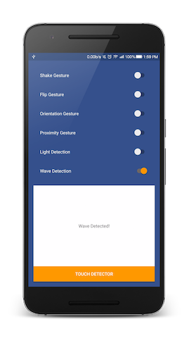
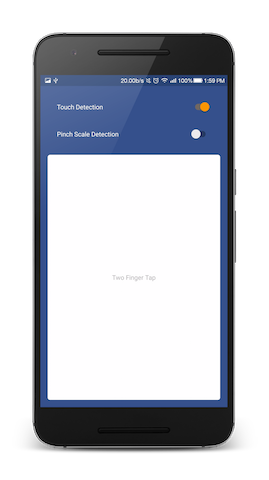

<div align="center">
  
</div>

<h1 align="center">Sensey <a href="https://twitter.com/intent/tweet?text=Sensey%3A%20Android%20library%20which%20makes%20playing%20with%20sensor%20events%20%26%20detecting%20gestures%20a%20breeze%F0%9F%98%8E&url=https://github.com/nisrulz/sensey&via=nisrulz&hashtags=AndroidDev">
        
    </a></h1>

<div align="center">
  <strong>Android library which makes playing with sensor events & detecting gestures a breeze.</strong>
  <p>The library is built for simplicity and ease of use. It eliminates most boilerplate code for dealing with setting up sensor based event and gesture detection on Android.</p>
</div>
<br/>
<div align="center">
    <!-- Bintray -->
    <a href="https://bintray.com/nisrulz/maven/com.github.nisrulz%3Asensey/_latestVersion">
        
    </a>
    <!-- API -->
    <a href="https://android-arsenal.com/api?level=14">
        
    </a>
    <!-- Android Arsenal -->
    <a href="https://android-arsenal.com/details/1/3550">
        
    </a>
    <!-- Android Sweets -->
    <a href="https://androidsweets.ongoodbits.com/2016/05/26/issue-20">
        
    </a>
    <!-- Android Dev Digest -->
    <a href="https://www.androiddevdigest.com/digest-100/">
        
    </a>
    <!-- Android Dev Digest -->
    <a href="https://www.androiddevdigest.com/digest-131/">
        
    </a>
    <!-- Android Weekly -->
    <a href="http://androidweekly.net/issues/issue-209">
        
    </a>
    <!-- Android Weekly -->
    <a href="http://androidweekly.net/issues/issue-245">
        
    </a>
    <!-- Awesome Android -->
    <a href="https://snowdream.github.io/awesome-android/Other.html#Gesture">
        
    </a>
    <!-- GitHub stars -->
    <a href="https://github.com/nisrulz/sensey">
        
    </a>
    <!-- GitHub forks -->
    <a href="https://github.com/nisrulz/sensey/fork">
        
    </a>
    <!-- GitHub watchers -->
    <a href="https://github.com/nisrulz/sensey">
        
    </a>
    <!-- Say Thanks! -->
    <a href="https://saythanks.io/to/nisrulz">
        
    </a>
    <a href="https://www.paypal.me/nisrulz/5">
        
    </a>
    <br/>
     <!-- GitHub followers -->
    <a href="https://github.com/nisrulz/sensey">
        
    </a>
    <!-- Twitter Follow -->
    <a href="https://twitter.com/nisrulz">
        
    </a>
</div>

<div align="center">
    Also featured in [Awesome Android Newsletter
    <a href="https://android.libhunt.com/newsletter/5">
         #Issue 5
    </a>, 
    <a href="https://android.libhunt.com/newsletter/21">
         #Issue 21
    </a>],
    <a href="https://github.com/codepath/android_guides/wiki/Must-Have-libraries#convenience">
         Codepath's Must Have Libraries
    </a>, 
    <a href="https://medium.cobeisfresh.com/cobes-top-5-android-libraries-september-2016-883757e61bf0#.oe2lzaxyn">
         COBE’s Top 5 Android Libraries — September 2016
    </a>, 
    <a href="https://cloudrail.com/best-android-libraries-for-developers/">
         Best Android Libraries for Developers
    </a>, 
    <a href="https://dzone.com/articles/this-week-in-mobile-may-15">
         DZone
    </a>, 
    <a href="http://email.changelog.com/t/t-310383437622D164">
        Changelog Weekly Issue #115
    </a>
</div>

<div align="center">
    Blog Post: 
    <a href="https://android.jlelse.eu/i-could-not-find-a-simple-gesture-detection-android-library-so-i-built-one-334c0a307c16#.1us4zgise">
         I could not find a simple Gesture Detection android library, so I built one
    </a>
</div>


<div align="center">
  <sub>Built with ❤︎ by
  <a href="https://twitter.com/nisrulz">Nishant Srivastava</a> and
  <a href="https://github.com/nisrulz/sensey/graphs/contributors">
    contributors
  </a>
</div>
<br/>
<br/>

### Screenshot of sample app

 

# Supported gestures/events

 1. [Flip](https://github.com/nisrulz/sensey/wiki/Usage#flip)
    + onFaceUp
    + onFaceDown
 1. [Light](https://github.com/nisrulz/sensey/wiki/Usage#light)
    + onDark
    + onLight
 1. [Orientation](https://github.com/nisrulz/sensey/wiki/Usage#orientation)
    + onTopSideUp
    + onBottomSideUp
    + onLeftSideUp
    + onRightSideUp
 1. [PinchScale](https://github.com/nisrulz/sensey/wiki/Usage#pinchscale)
    + OnScale
    + OnScaleStart
    + OnScaleEnd
 1. [Proximity](https://github.com/nisrulz/sensey/wiki/Usage#proximity)
    + onNear
    + onFar
 1. [Shake](https://github.com/nisrulz/sensey/wiki/Usage#shake)
 1. [Wave](https://github.com/nisrulz/sensey/wiki/Usage#wave)
 1. [Chop](https://github.com/nisrulz/sensey/wiki/Usage#chop)
 1. [WristTwist](https://github.com/nisrulz/sensey/wiki/Usage#wristtwist)
 1. [Movement](https://github.com/nisrulz/sensey/wiki/Usage#movement)
 1. [SoundLevel](https://github.com/nisrulz/sensey/wiki/Usage#soundlevel)
 1. [RotationAngle](https://github.com/nisrulz/sensey/wiki/Usage#rotationangle)
 1. [TiltDirection](https://github.com/nisrulz/sensey/wiki/Usage#tiltdirection)
 1. [TouchType](https://github.com/nisrulz/sensey/wiki/Usage#touchtype)
    + onDoubleTap
    + onScroll(direction)
    + onSingleTap
    + onSwipeLeft
    + onSwipeRight
    + onLongPress
    + onTwoFingerSingleTap
    + onThreeFingerSingleTap


# Changelog

Starting with `1.0.1`, Changes exist in the [releases tab](https://github.com/nisrulz/sensey/releases).

# Including in your project
Sensey is available in the Jcenter, so getting it as simple as adding it as a dependency
```gradle
implementation 'com.github.nisrulz:sensey:{latest version}'
```
where `{latest version}` corresponds to published version in [  ](https://bintray.com/nisrulz/maven/com.github.nisrulz%3Asensey/_latestVersion)

# Simple example

+ To initialize Sensey under your `onCreate()`` in the activity/service, call
```java
Sensey.getInstance().init(context);
```

+ To stop Sensey, under your `onDestroy()` in the activity/service, call
```java
 // *** IMPORTANT ***
 // Stop Sensey and release the context held by it
 Sensey.getInstance().stop();
```

+ Next to enable shake detection 
  + Create an instance of ShakeListener
  ```java
  ShakeDetector.ShakeListener shakeListener=new ShakeDetector.ShakeListener() {
      @Override public void onShakeDetected() {
         // Shake detected, do something
     }

     @Override public void onShakeStopped() {
         // Shake stopped, do something
     }
  };
  ```
  + Now to start listening for Shake gesture, pass the instance `shakeListener` to `startShakeDetection()` function
  ```java
  Sensey.getInstance().startShakeDetection(shakeListener);
  ```
  
  If you want to modify the `threshold` and `time` before declaring that shake gesture is stopped, use
  ```java
  Sensey.getInstance().startShakeDetection(threshold,timeBeforeDeclaringShakeStopped,shakeListener);
  ```
  + To stop listening for Shake gesture, pass the instance `shakeListener` to `stopShakeDetection()` function
  ```java
  Sensey.getInstance().stopShakeDetection(shakeListener);
  ```

### :page_with_curl: For more info , check the **[Wiki Docs](https://github.com/nisrulz/sensey/wiki/Usage)**


# Pull Requests
I welcome and encourage all pull requests. It usually will take me within 24-48 hours to respond to any issue or request. Here are some basic rules to follow to ensure timely addition of your request:
  1. Match coding style (braces, spacing, etc.) This is best achieved using CMD+Option+L (Reformat code) on Mac (not sure for Windows) with Android Studio defaults. This project uses a [modified version of Grandcentrix's code style](https://github.com/nisrulz/AndroidCodeStyle/tree/nishant-config), so please use the same when editing this project.
  2. If its a feature, bugfix, or anything please only change code to what you specify.
  3. Please keep PR titles easy to read and descriptive of changes, this will make them easier to merge :)
  4. Pull requests _must_ be made against `develop` branch. Any other branch (unless specified by the maintainers) will get rejected.
  5. Check for existing [issues](https://github.com/nisrulz/sensey/issues) first, before filing an issue.  
  6. Have fun!

## Apps using Sensey
If you are using Sensey in your app and would like to be listed here, please let me know by opening a [new issue](https://github.com/nisrulz/sensey/issues/new)!

+ Push-Ups - [Playstore](https://play.google.com/store/apps/details?id=com.mk.push)
+ FastAccess - [Github](https://github.com/k0shk0sh/FastAccess)
+ Catradiod - [Playstore](https://play.google.com/store/apps/details?id=com.yopachara.catradiod), [Github](https://github.com/yopachara/Catradiod)

[Other apps using Sensey, via AppBrain Stats](https://www.appbrain.com/stats/libraries/details/sensey/sensey)

## License
Licensed under the Apache License, Version 2.0, [click here for the full license](/LICENSE.txt).

## Author & support
This project was created by [Nishant Srivastava](https://github.com/nisrulz/nisrulz.github.io#nishant-srivastava) but hopefully developed and maintained by many others. See the [the list of contributors here](https://github.com/nisrulz/sensey/graphs/contributors).

> If you appreciate my work, consider buying me a cup of :coffee: to keep me recharged :metal:
>  + [PayPal](https://www.paypal.me/nisrulz/5)
>  + Bitcoin Address: 13PjuJcfVW2Ad81fawqwLtku4bZLv1AxCL
>
> I love using my work and I'm available for contract work. Freelancing helps to maintain and keep [my open source projects](https://github.com/nisrulz/) up to date!

