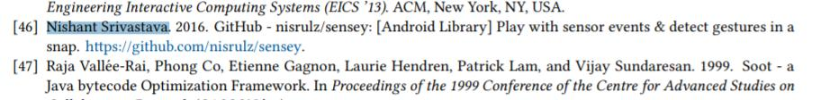
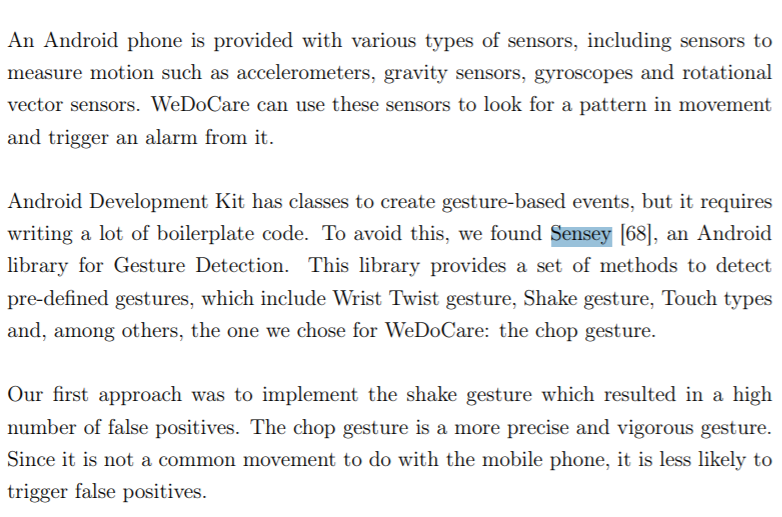

# References

Sensey is being used in a lot of places. This file exists to keep track of those instances.

1. Research work at the University at Buffalo, The State University of New York, USA
    - Paper
        
        1. [Main Link](https://nsr.cse.buffalo.edu/wp-content/uploads/2019/06/gesto-eics2019.pdf)
        1. [ACM Link](https://dl.acm.org/citation.cfm?doid=3340630.3300964)
        1. [Copy in repo](gesto/gesto-eics2019.pdf)
    - Presentation
        1. [Main Link](http://beyondthegeek.com/wp-content/uploads/2018/10/gesto.pptx)
        1. [Copy in repo](gesto/gesto.pptx)

1. Thesis from the University of Coimbra for the degree of Master in Biomedical Engineering, uses Sensey to trigger an alarm to help vulnerable social groups via WeDoCare app they built
    - Thesis
        
        1. [Main Link](https://eg.uc.pt/bitstream/10316/86127/1/Disserta%C3%A7%C3%A3o%20M%C3%A1rcia%20Rocha.pdf)
        1. [Copy in repo](wedocare/thesis.pdf)

1. Apps using Sensey

    - Push-Ups - [Playstore](https://play.google.com/store/apps/details?id=com.mk.push)
    - FastAccess - [Github](https://github.com/k0shk0sh/FastAccess)
    - Catradiod - [Playstore](https://play.google.com/store/apps/details?id=com.yopachara.catradiod), [Github](https://github.com/yopachara/Catradiod)
    - Get Off Your Phone - [Play Store](https://play.google.com/store/apps/details?id=com.nephi.getoffyourphone)

    - [Other apps using Sensey, via AppBrain Stats](https://www.appbrain.com/stats/libraries/details/sensey/sensey)

    > If you are using Sensey in your app and would like to be listed here, please let me know by opening a [new issue](https://github.com/nisrulz/sensey/issues/new)!